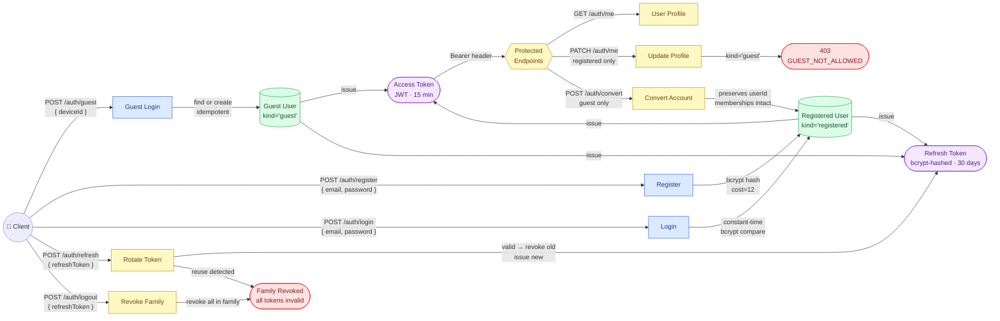
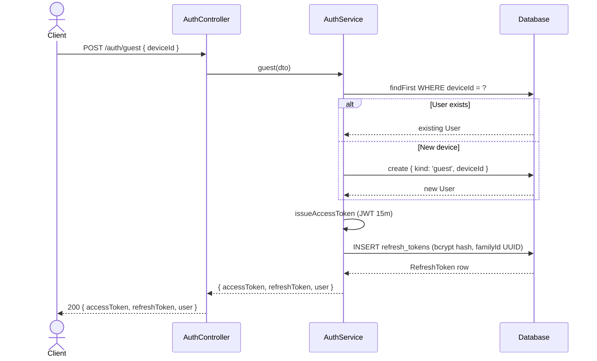
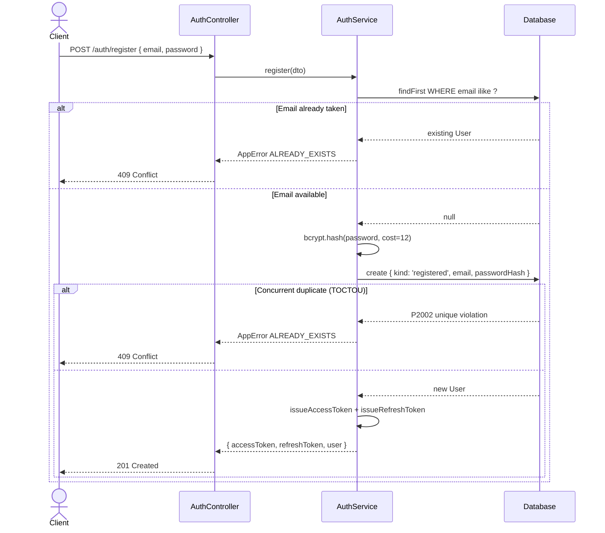
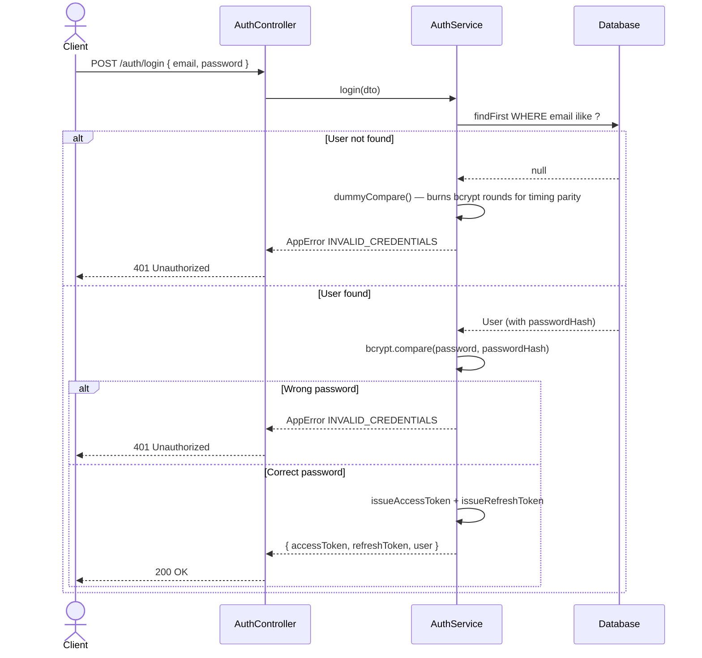
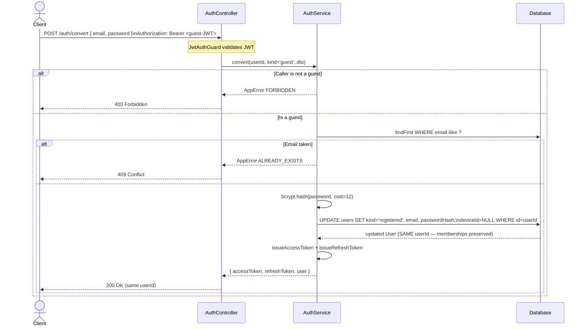
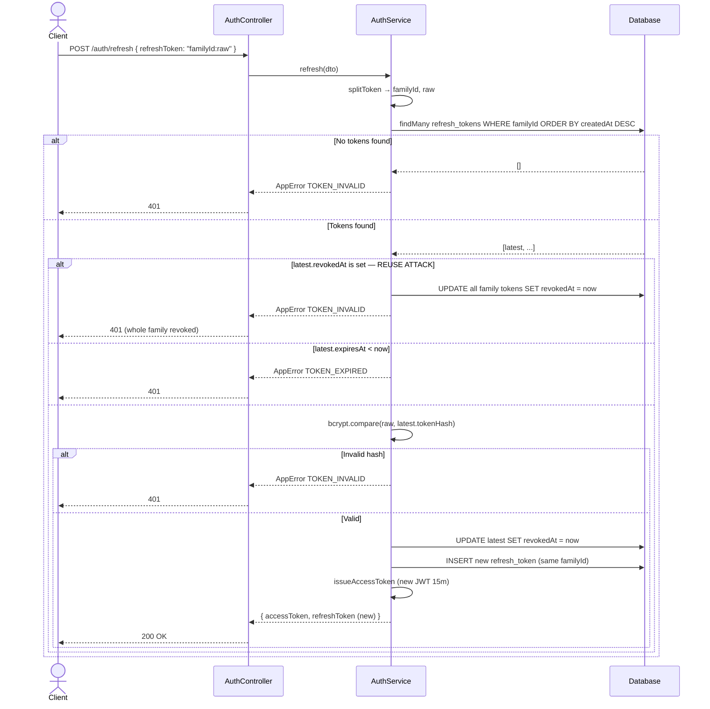
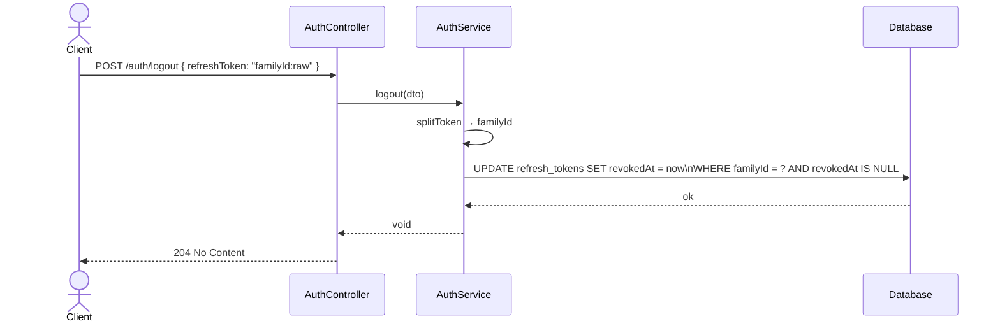

# AUTH System Implementation Plan

## Overview

Full JWT-based authentication system for the ftaar-app NestJS backend, covering guests (device-ID based), registered users (email/password), token refresh with rotation + family revocation, and profile management.

---

## Authentication Flow Diagrams

### Overview — Complete Auth System





### 2. Register (AUTH-11)



### 3. Login (AUTH-13)



### 4. Convert Guest → Registered (AUTH-12)



### 5. Token Refresh (AUTH-14)



### 6. Logout (AUTH-15)



### 7. JWT Guard Flow (every protected request)

```mermaid
flowchart TD
    REQ([Incoming Request]) --> GUARD{JwtAuthGuard}
    GUARD -->|@Public() on handler/class| PASS([Allow — skip JWT check])
    GUARD -->|No @Public()| PASSPORT[Passport extracts Bearer token]
    PASSPORT -->|Missing token| ERR1[AppError UNAUTHORIZED 401]
    PASSPORT -->|Token present| VERIFY{Verify signature\n& expiry}
    VERIFY -->|TokenExpiredError| ERR2[AppError TOKEN_EXPIRED 401]
    VERIFY -->|JsonWebTokenError| ERR3[AppError TOKEN_INVALID 401]
    VERIFY -->|Valid| VALIDATE[JwtStrategy.validate\nlookup user in DB]
    VALIDATE -->|User not found| ERR4[AppError TOKEN_INVALID 401]
    VALIDATE -->|Found| ATTACH[Attach user to req.user]
    ATTACH --> HANDLER([Route handler executes])
```

---

## Tasks Covered

### AUTH Tasks

| Task    | Description                                                              |
| ------- | ------------------------------------------------------------------------ |
| AUTH-01 | Prisma `RefreshToken` model + migration                                  |
| AUTH-02 | `PasswordService` — bcrypt hash/compare                                  |
| AUTH-03 | `UserRepository` — CRUD helpers, never expose `passwordHash`             |
| AUTH-04 | `TokenService` — issue/rotate/revoke JWT + refresh tokens                |
| AUTH-05 | `JwtStrategy` — Passport JWT Bearer extraction                           |
| AUTH-06 | `JwtAuthGuard` — global guard with `@Public()` bypass                    |
| AUTH-07 | `@Public()` / `@CurrentUser()` decorators                                |
| AUTH-08 | DTOs — GuestDto, RegisterDto, RefreshDto, LogoutDto, UpdateMeDto         |
| AUTH-09 | Refresh token family revocation on reuse (security event)                |
| AUTH-10 | `POST /auth/guest` — idempotent device-ID → userId                       |
| AUTH-11 | `POST /auth/register` — create registered user                           |
| AUTH-12 | `POST /auth/convert` — upgrade guest → registered (same userId)          |
| AUTH-13 | `POST /auth/login` — constant-time compare even on missing user          |
| AUTH-14 | `POST /auth/refresh` — rotate refresh token                              |
| AUTH-15 | `POST /auth/logout` — revoke refresh token family                        |
| AUTH-16 | `RegisteredUserGuard` — 403 for guests on registered-only routes         |
| AUTH-17 | `AppModule` wiring — global `JwtAuthGuard`, remove stub `AuthController` |

### USER Tasks

| Task    | Description                                                         |
| ------- | ------------------------------------------------------------------- |
| USER-01 | `GET /auth/me` — return profile, never `passwordHash`               |
| USER-02 | `PATCH /auth/me` — update `displayName`                             |
| USER-03 | `PATCH /auth/me` — update/clear `instaPayHandle` (stored lowercase) |

---

## Architecture

```
apps/backend/src/
├── auth/
│   ├── auth.module.ts          # JwtModule, PassportModule, all providers
│   ├── auth.service.ts         # Business logic for all auth endpoints
│   ├── auth.controller.ts      # Route handlers
│   ├── decorators/
│   │   ├── public.decorator.ts       # @Public() — skips JwtAuthGuard
│   │   └── current-user.decorator.ts # @CurrentUser() param decorator
│   ├── dto/
│   │   ├── guest.dto.ts         # { deviceId: string }
│   │   ├── register.dto.ts      # { email, password }
│   │   ├── refresh.dto.ts       # { refreshToken: string }
│   │   ├── logout.dto.ts        # { refreshToken: string }
│   │   └── update-me.dto.ts     # { displayName?, instaPayHandle? }
│   ├── guards/
│   │   ├── jwt-auth.guard.ts         # Extends AuthGuard('jwt'), checks IS_PUBLIC
│   │   └── registered-user.guard.ts  # Blocks guests with GUEST_NOT_ALLOWED
│   ├── services/
│   │   ├── password.service.ts       # bcrypt hash (cost 12) + compare
│   │   ├── token.service.ts          # JWT + refresh token lifecycle
│   │   └── user-repository.service.ts# DB CRUD — never returns passwordHash
│   └── strategies/
│       └── jwt.strategy.ts           # Passport JWT strategy
├── core/
│   ├── config/
│   │   ├── env.schema.ts       # + JWT_SECRET validation
│   │   └── app-config.service.ts # + jwtSecret getter
│   └── errors/
│       └── error-codes.ts      # + GUEST_NOT_ALLOWED → 403
└── prisma/
    └── schema.prisma           # + instaPayHandle on User, RefreshToken model
```

---

## Database Changes

### User model additions

- `instaPayHandle String? @map("insta_pay_handle") @db.VarChar(100)`

### New RefreshToken model

```prisma
model RefreshToken {
  id        String    @id @default(dbgenerated("gen_random_uuid()")) @db.Uuid
  userId    String    @map("user_id") @db.Uuid
  user      User      @relation(...)
  tokenHash String    @map("token_hash") @db.VarChar(255)
  familyId  String    @map("family_id") @db.Uuid
  expiresAt DateTime  @map("expires_at") @db.Timestamptz(6)
  revokedAt DateTime? @map("revoked_at") @db.Timestamptz(6)
  createdAt DateTime  @default(now()) @map("created_at") @db.Timestamptz(6)
  // indexes: userId, familyId
}
```

---

## Security Decisions

| Decision                              | Rationale                                                          |
| ------------------------------------- | ------------------------------------------------------------------ |
| bcrypt cost 12                        | ~250ms on modern hardware — balances UX and brute-force resistance |
| Access token 15 min                   | Short-lived; compromise window is small                            |
| Refresh token 30 days, rotated on use | Long sessions without persistent login risk                        |
| Family revocation on reuse            | Detects refresh token theft — entire token chain is revoked        |
| Constant-time login                   | Same error + dummy compare when user not found (AUTH-13)           |
| `passwordHash` never returned         | Defensive: stripped at repository layer                            |
| `@Public()` metadata guard            | Opt-in public routes vs opt-out; secure by default                 |

---

## Environment Variables Required

| Variable       | Rule                   |
| -------------- | ---------------------- |
| `DATABASE_URL` | `postgresql://` URL    |
| `JWT_SECRET`   | Min 32 chars, required |

---

## Endpoints

| Method | Path           | Auth        | Description                           |
| ------ | -------------- | ----------- | ------------------------------------- |
| POST   | /auth/guest    | Public      | Get/create guest user by deviceId     |
| POST   | /auth/register | Public      | Create registered user                |
| POST   | /auth/convert  | JWT (guest) | Upgrade guest to registered           |
| POST   | /auth/login    | Public      | Email/password login                  |
| POST   | /auth/refresh  | Public      | Rotate refresh token                  |
| POST   | /auth/logout   | Public      | Revoke refresh token family           |
| GET    | /auth/me       | JWT         | Get current user profile              |
| PATCH  | /auth/me       | JWT         | Update display name / instaPay handle |

---

## Implementation Status

- [x] Install packages (`@nestjs/jwt`, `@nestjs/passport`, `passport`, `passport-jwt`, `bcrypt`)
- [x] Update `prisma/schema.prisma`
- [x] Update `error-codes.ts` — add `GUEST_NOT_ALLOWED`
- [x] Update `env.schema.ts` — add `JWT_SECRET`
- [x] Update `app-config.service.ts` — add `jwtSecret` getter
- [x] `auth/decorators/public.decorator.ts`
- [x] `auth/decorators/current-user.decorator.ts`
- [x] `auth/dto/*.ts`
- [x] `auth/guards/jwt-auth.guard.ts`
- [x] `auth/guards/registered-user.guard.ts`
- [x] `auth/strategies/jwt.strategy.ts`
- [x] `auth/services/password.service.ts`
- [x] `auth/services/user-repository.service.ts`
- [x] `auth/services/token.service.ts`
- [x] `auth/auth.service.ts`
- [x] `auth/auth.controller.ts`
- [x] `auth/auth.module.ts`
- [x] Update `app/app.module.ts` — wire `AuthModule`, global `JwtAuthGuard`, remove stub
- [x] Delete `app/auth.controller.ts`
- [ ] Run `prisma migrate dev`
